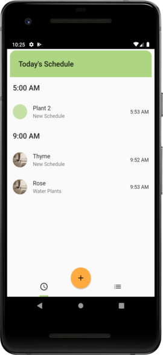

# Thyme

Manage your plants with Thyme. Create plant profiles that allow you to keep track of specific plants. Set alarms for plant maintenance such as

- Watering
- Fertilizing
- Pruning
- and more!

## Features
- Reminders using [flutter_local_notification](https://pub.dev/packages/flutter_local_notifications)
- Uses [sqflite](https://pub.dev/packages/sqflite) to store data

## Screenshots

